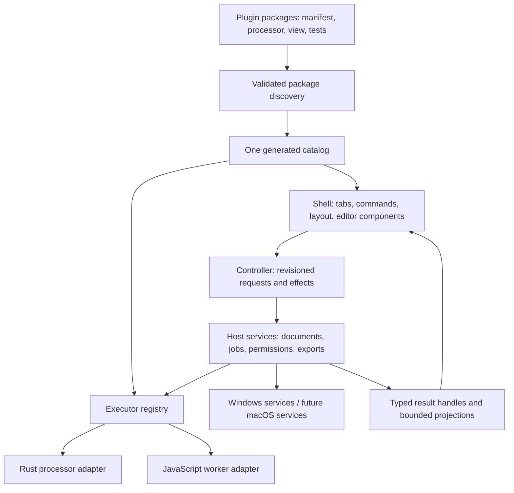

# Plugin system design — Windows first, portable core

Status: design specification, 2026-09-15. This document does not claim the plugin runtime is implemented.

## Product contract

The 27 local guides supplied by the user are the **minimum functional and interaction baseline**, not a ceiling. [DEVUTILS_REQUIREMENTS.md](DEVUTILS_REQUIREMENTS.md) maps each guide to operations, options, presentation, and acceptance cases. The review includes the guide text and 51 tool screenshots; source hashes and screenshot ordinals are in [references/devutils-sources.json](references/devutils-sources.json). Existing requirements for editable tabs, large files, image/Base64, JSON escaping, and find/replace remain in scope.

Windows is the first shipping platform. Tool semantics, package contracts, themes, and workspace state are portable. A later macOS host supplies platform commands and OS integrations. The supplied screenshots are visual and interaction targets: match their density, control placement and useful behavior, using our branding and neutral dark theme. Windows chrome, fonts and shortcuts are deliberate platform adaptations.

**Completion criterion:** a worker can add a package containing a manifest, processor, optional workspace view, fixtures, and tests. Discovery adds it to the sidebar, search, command palette, and execution registry with no hand edits to the shell, bridge, or host dispatcher. Existing tool workflows keep passing interaction tests.

## What exists, and what must change

| Current code | Reuse | Gap |
|---|---|---|
| `crates/devtools-core/src/tool.rs` | Serializable v1 metadata, diagnostics, registry experiment | `GenericTool` is an in-memory interface; it is not the host's universal streaming dispatch path. Manifest lists and processors need to move into packages. |
| `apps/desktop/src-tauri/src/main.rs` | Document handles, snapshots, temporary output, job events, save validation | Dispatch still branches on tool IDs; compare has a separate command. It must delegate through one executor registry. |
| `apps/desktop/src/workbench/state.ts` | Pure reducer, per-tab generation tokens, undo/redo | `rightText` and find fields are tool-specific. Replace with named document bindings and scoped plugin instance state. |
| `apps/desktop/src/workbench/controller.ts` | Effect coordination, bounded reads, stale response rejection | Uses static `bundledTools`, compare branching, and tool-specific snapshot formats. Route through injected catalog and request descriptors. |
| `apps/desktop/src/main.ts` | Existing interactions and renderer behavior to preserve | Hard-coded samples, errors, tool checks, and DOM rendering. Move tool behavior into packages and reusable shell components. |
| `apps/desktop/src/toolViews/` | Useful earlier view prototypes | The registry is not consumed by the current `main.ts`. Do not describe these files as an active plugin architecture. Consolidate them during migration. |

The earlier v2 pseudocode in [Tool Contract and Document Model.md](../Tool%20Contract%20and%20Document%20Model.md) is a starting point. This design refines its ownership, bidirectional editing, options, and presentation rules. Draft interfaces below are implementation targets, not a second shipped protocol.

## Architecture and ownership



Shell owns editor models, tabs, focus, undo, accessibility, theme, splitters, shared progress, result lifetimes, and user commands. The host owns authoritative validation, files, clipboard I/O, permission grants, result storage, and scheduling. Plugins own algorithms, accepted syntax, defaults, option descriptions, samples, detection, and tool-specific state transitions. Views present data and emit intents; they do not call Tauri or manipulate another tool's DOM/state.

Dependencies point inward toward small SDK contracts. A processor imports the SDK and approved libraries, never a desktop crate. A view imports the UI SDK and shared components, never `main.ts`, the application reducer, or another plugin. Common parsers and algorithms belong in reusable libraries with independent versions. Plugins can share those libraries without depending on one another.

## Technology decisions

Keep Rust for byte-heavy algorithms and predictable large-file processing; keep Tauri for native services and TypeScript for UI. This migration does not require a frontend-framework rewrite. Establish component and state boundaries first. An editor component must support document models, incremental edits, selection, diagnostics, folding, and read-only ranges; choose its implementation in the editor foundation task through a Windows typing/IME/large-document proof.

Support two **trusted bundled** processor adapters under the same contract:

- Native Rust executors for streaming work, bytes, hashing, codecs, and parsers that have suitable Rust implementations.
- Dedicated JavaScript workers for algorithms with better compatible JS implementations. Formatting JS or HTML does not execute that source. Bound payloads before transfer; terminate workers on timeout. Worker memory is not a hard sandbox quota, and worker isolation alone does not prevent network access.

Do not force every tool to use Rust simply because the host does. Each engine declares its identity, version, syntax/dialect, encoding semantics, limits, and cancellation behavior. Library choices must pass fixtures for the actual reference behavior. Rust's default regex syntax, for example, must not be labeled ICU-compatible without evidence.

Bundled Rust executes trusted code and uses cooperative cancellation. A panic/error boundary can handle some failures, but cannot contain an abort or forcibly stop an arbitrary native loop. Engines requiring hard interruption, such as a backtracking regex implementation, need a terminable runner before they are enabled. Enforced limits and merely cooperative limits must be distinguishable in diagnostics and manifests.

### Bundled and installable are different delivery stages

Stage 1 discovers trusted packages at **build time**. A release rebuild is required. Deterministic tooling generates the Rust composition crate/dependency manifest and frontend import map before compilation; a Rust `build.rs` alone cannot add arbitrary Cargo dependencies. Workspace bootstrap, lockfile updates, and CI invocation are part of that tooling. Generated registrations are not hand-maintained integration work.

Stage 2 adds **runtime installation** behind the same request/result envelope. It needs package integrity, API/engine compatibility, enable/disable, atomic upgrades, rollback, per-plugin resource controls, and isolation. Do not load arbitrary Rust DLLs into the app or assume the Rust trait ABI is a stable external interface. Evaluate a constrained bytecode runtime or OS-contained subprocesses using real tools and supported platforms. This design does not select a runtime library or claim bundled components are sandboxed.

Third-party custom UI needs a separate, validated message boundary and contained surface. CSS modules or Shadow DOM are useful encapsulation for trusted views, not security isolation. Untrusted views never receive a shell DOM reference or the native bridge. A failed plugin must not prevent the editor or other plugins from opening.

## Package and discovery contract

Proposed layout, created by a future scaffold command:

```text
plugins/<plugin-id>/
  plugin.json                 # canonical package, tool and operation metadata
  processor/                  # Rust crate or worker module
  view/                       # optional specialized workspace, scoped styles
  fixtures/                   # independent input/expected output cases
  tests/                      # contract and interaction scenarios
  README.md                   # syntax, limits, known compatibility gaps
packages/plugin-contract/     # canonical schemas, generated Rust/TS types
packages/plugin-sdk/          # processor contexts and test doubles
packages/workbench-ui/        # editor, form, tree, diff, image, preview, status
```

One package may expose several tools (e.g. YAML↔JSON) without hiding required operations from search. Packages use stable namespaced IDs. Existing tool IDs retain aliases during migration so saved tab state and commands resolve correctly.

Manifest fields:

| Field | Meaning |
|---|---|
| `id`, `version`, `apiVersion`, `stateVersion` | Package identity, compatibility, and persisted-state migration |
| `tools[]` | Stable tool ID, title, category, search aliases, icon token, description, samples |
| `operations[]` | Input/output port specs, options schema and defaults, triggers, executor and version |
| `inputs` | Named ports: document, bounded value, selection, secret; zero/one/many; required per operation |
| `outputs` | Named artifact/value/report ports, MIME/language, available representations, sensitivity, exports |
| `workspace` | Supported layout, component bindings, command placement, optional trusted view module |
| `detection` | Bounded probe, confidence, user setting, automatic activation policy |
| `capabilities` | Requested host services, local resource budgets, preview policies, platform requirements |
| `settings` | Tool defaults and instance overrides; sensitive/nonpersistent fields explicitly marked |
| `tests` | Reference requirement IDs, fixture cases, expected diagnostics, UI scenarios |

Schemas are versioned and generate language types. Validate both at discovery and before execution. Reject duplicate IDs, nonexistent port/command references, incompatible API versions, invalid defaults, and unknown executors. Reject unknown requested capabilities; never turn an unknown permission field into a grant. Unknown optional extension metadata can be ignored. Disable an invalid installed/development package with a useful explanation while the rest of the catalog loads; release builds fail when a required first-party package is invalid instead of silently shipping fewer tools.

Standard option types: boolean, string, integer, exact decimal string, enum, list, record, tagged union, language-aware document, secret, and file/image handle. Support grouped advanced settings, reset, ranges, allowed choices, and declarative conditional visibility/required rules. No eval or arbitrary JavaScript in manifest conditions. Host validates hidden and programmatic fields too. Expensive semantic checks belong in the processor with structured errors.

## Request, result, and document contracts

Use named ports instead of a global left/right text pair:

```text
ExecuteRequest {
  apiVersion, pluginId, pluginVersion, toolId, operationId,
  instanceId, jobId, generation,
  inputs: { portId: DocumentRef | Value | SelectionRef | SecretRef },
  options, trigger: { kind, changedPort?, origin },
  context: { locale, timezone, capturedClock?, randomnessHandle? },
  requestedLimits
}

DocumentRef { id, revision, byteLength, contentKind, mime, language, encoding, newline }
SelectionRef { documentId, revision, selectionEpoch, startByte, endByte }
Completed { jobId, generation, outputs: { portId: OutputDescriptor }, diagnostics, stats, provenance }
OutputDescriptor { representation, artifactRef?, boundedValue?, language?, mime?, complete, availableViews, exportFormats }
```

Host attaches effective grants and budgets; it never trusts a caller-supplied grant. Document handles are scoped to the instance/job. A processor gets readers/range services and an output sink, not arbitrary source/destination paths. Complete output remains host-owned. Large values use artifact handles; byte lengths and integers exceeding JSON's exact numeric range serialize as decimal strings.

The following representations are first-class: text/code, image, table, tree, diff, scalar property list, annotated document ranges, preview document, and combinations of named outputs. A renderer requests pages/ranges and may expose alternate views of the same result. Preview truncation is metadata, never appended to payload bytes. Copy, Save, Use as input, and Open as tab operate on the complete artifact or explain the applicable size limit; they never silently promote the visible prefix.

The host validates MIME/signature and supported renderer combinations. Images, tree/diff views and status-only reports replace the text surface; an invisible textarea must not consume result height. A successful inspector can return a property list without manufacturing an empty output document.

Editors translate UTF-16 cursor positions to authoritative UTF-8 byte spans for a specific document revision. Graphemes, code points, bytes and code units are distinct measurements. A grapheme can contain several code points; non-ASCII characters have no ASCII code. Normalization is never an implicit edit. A stale selection cannot annotate a newer document.

### Job lifecycle and limits

Lifecycle: accepted → queued → running → completed / failed / cancelled. Exactly one terminal event; duplicate terminal messages are ignored. Every progress, range response, annotation, and output includes enough identity to reject results from another instance/generation/version. Output sinks publish atomically only after successful finalization. Cancelled, superseded and abandoned jobs release temporary artifacts after active copy/save/read consumers release their leases.

Enforce global and per-instance concurrency, max queued jobs, input/output/chunk limits, deadlines, decode dimensions, table/tree/annotation limits and preview limits. Reject oversize work before allocation. Chunk delivery uses bounded queues/backpressure. Cancellation acknowledges a request separately from completion of cleanup; do not promise a universal 100 ms hard stop for cooperative native code. Include bounded cleanup/termination tests for each runner.

Deterministic tools may cache on input revisions/content hashes, options, plugin/engine versions, locale/timezone and relevant context. Random, clock-dependent or secret-bearing operations use explicit policies: capture time/seed where appropriate, disable ordinary cache/history for secrets, and do not regenerate on tab activation or render. Host clamps limits; a plugin cannot opt out.

## State management and linked editing

Split state into workspace (tabs/active ID), document models (content/revision/undo), instance state (tool/operation/options/port bindings), derived results (handles/provenance), and ephemeral view state (caret/scroll/expanded nodes). Plugin reducers are pure: `(state, event) -> nextState + effectIntents`. The controller interprets effects with the instance's scoped SDK. Processors never mutate a store.

An instance key contains tab ID plus plugin/tool identity. Keep serializable per-tool drafts/options within a tab when switching tools; apply reference-counted cleanup to result handles. Closing an instance disposes listeners, timers, workers, previews and annotations. Secrets are session-only by default and excluded from persisted workspace, undo snapshots outside their secure field, logs, errors and provenance. The design cannot promise zeroization of all JS string copies; minimize their lifetime and use host secret handles during processing.

For bidirectional tools, a user edit carries an origin, changed port and revision vector. One transaction chooses the authoritative field, runs the applicable operation, and applies derived changes only if the expected input revisions still match. Derived updates do not trigger the inverse operation.

Examples:

- **JWT:** a token edit decodes header/payload and verifies with the selected algorithm/key. It does not re-sign the pasted token. Header/payload/key edits in the signing workspace can request signing, then replace the generated token as a derived update. Pending sign output cannot overwrite a newer pasted token. Signature status is separate from expiry/claim diagnostics; editing a key must never turn an invalid incoming signature into a misleading verified result. Auto-sign is visible and scoped to the active signing workflow.
- **Number bases:** editing base 16 makes that field authoritative for this transaction; other bases update once. Intermediate text such as `-` remains editable. Never coerce exact integers through floating-point JavaScript numbers.
- **Inspector:** selection changes increment a selection epoch and request statistics for that range without changing document dirty state or rerunning the full-document analysis unnecessarily.
- **Lorem/UUID:** generation requires a user action (or explicit held-button repeat), not an incidental render. Accumulating output is a reducer append/replace transaction with undo and a size cap.

Input edits, semantic options and algorithm changes invalidate execution results; panel resize, theme and output display choice generally do not. Structured view changes reuse an artifact where possible. Read failures and stale results must never remain labeled Valid.

## Shared workspace vocabulary and UX contract

| Workspace | Required tool examples | Shared pieces |
|---|---|---|
| Single editor | Text editor, find/replace | One document model, search, undo, line/column, no empty result pane |
| Transform | JSON, encoders, formatters, YAML, SQL, JSX | Editable source, code result, diagnostics, operation and output-format controls |
| Annotated editor | Regex, String Inspector | Source/selection, match navigation, annotation layers, tree/property/table views |
| Linked fields | Timestamp, number bases, JWT | Labeled editors/values, conditional keys, field copy, guarded derived updates |
| Compare | Diff | Two editable inputs with own file/paste controls, swap, result drawer or split, diff navigation |
| Generator | UUID, Lorem Ipsum | Parameter form/action strip, generated document, append/replace modes |
| Media/preview | Image/Base64, QR, HTML, Markdown | Typed document/image inputs, top-aligned result viewer, view selector, export/clipboard image |

Layouts compose shell-owned split/panel primitives. Panels have stable IDs, minimum usable sizes, visibility, orientation and persistence policy. Specialized views fill an allocated region using shared components and scoped styles. Additional tool families can supply a layout/view through the same extension point without adding `if toolId === ...` to the shell. Optional new renderer APIs require an SDK version and an independent renderer review, not private shell patching.

Visual and behavior invariants:

1. Neutral charcoal surfaces and legible text; blue is reserved for focus/selection/actions. All shell and plugin UI uses central tokens; no plugin styles target global `body`, buttons or hidden rules. Content previews may show their document's own colors.
2. Compact searchable left rail and command palette generated from the same catalog. Visible tool names describe implemented behavior. Unavailable operations explain the missing input/capability.
3. Input actions (Clipboard, Sample, Clear, Open) belong with that input; format options and Copy/Save belong with the output. One primary control per command: no repeated Format/Minify/Validate dropdown plus identical button set.
4. Tool selection plus compatible input expresses intent for safe transforms. Auto-run after valid edits is debounced; don't interrupt IME composition. Generators, signing workflows, and privileged actions declare explicit triggers. Large work goes through the same asynchronous job service.
5. Fast jobs do not flash a large progress panel. Show progress after a short delay (initial target 200 ms) in a fixed status-bar slot; slower jobs expose Cancel/details without resizing editors. Idle progress uses no permanent blank 52 px panel. Keep the last result marked stale until replaced; do not recreate editors on job events.
6. Error, success and preview transitions preserve focus, caret, scroll, and pane geometry. A compact diagnostic anchor opens an error list on demand; diagnostics jump to source locations. Do not show the same error in multiple large banners.
7. Result surface is chosen by type, sized to remaining space, and top-aligned for images. Empty, text, media, diff and report states are mutually exclusive. `[hidden]` is honored globally. Collapse and resize work by mouse and keyboard and survive reopening where appropriate.
8. Each tab retains its tool, inputs, options, results, and editor state. New creates an editable text tab; Open/import/drop targets the declared input or opens a new tab without losing a dirty document. A source file changes only when its own tab saves it (the save policy in PLUGIN_HOST_IMPLEMENTATION.md); a tool run never writes it.
9. Clipboard actions are typed: text, image, and rich HTML with plain-text fallback. File drops route to input ports, not a generic decode-as-text path. Complete Base64 round trips must work beyond the preview limit.
10. UI tests exercise actual editor entry, paste, tool selection, result rendering and layout through state changes. A successful TypeScript build or CSS-selector test is insufficient evidence of a working UI.

## Platform services

Commands have semantic IDs and platform bindings, never hard-coded key labels inside plugins.

| Intent | Windows first | macOS later |
|---|---|---|
| New/Open/Save/Close tab | Ctrl+N/O/S/W | Cmd+N/O/S/W |
| Copy/Paste/Undo/Redo | Ctrl+C/V/Z; Ctrl+Y and Ctrl+Shift+Z | Cmd+C/V/Z; Cmd+Shift+Z |
| Find/Replace/Commands | Ctrl+F / Ctrl+H / Ctrl+K | Cmd+F / platform replace binding / Cmd+K |
| Activate from elsewhere | Configurable global shortcut and tray action; surface conflicts | Configurable shortcut and menu-bar action |
| Inspect selected content | Explicit clipboard import; optional Windows integration | Later Services/context menu integration |
| Files/images/exports | Native dialogs and typed Windows clipboard adapter | Native dialogs and macOS pasteboard adapter |

Resolve native conventions, fonts, DPI, high contrast, accessibility, locale/timezone, line endings, paths, secret storage and external-browser launch behind host services. Ctrl/Cmd translation alone is not a macOS port. Run core semantic fixtures on both OSes and platform UI tests when each host is enabled.

Clipboard detection only runs in the user-enabled activation/import flow; no background clipboard polling. A bounded probe returns candidates, confidence, and reasons. It must not override a manually selected tool in an existing tab or consume/change pasted content. Show a choice for ambiguous data and support per-tool disable/reset settings.

## HTML/Markdown and sensitive tools

HTML preview supports CSS and optional scripts, navigation, and outbound resources as independent controls, matching the reference's default-disabled settings. It is a separate unprivileged document surface with no Tauri API, shell storage, application origin, or arbitrary file access. Renderer policy must be enforced by the host, not only by a plugin checkbox. XML external entities and remote schema fetches are disabled in offline formatting.

Granting scripts does not grant network, navigation, filesystem, or native commands. A local relative resource uses a user-scoped resource service; external resources require a deliberate grant. Disposing or revoking a preview tears down its context. Browser preview is an explicit export/open command using a scoped generated file/service: its content is updated for refresh, with no privileged API exposed. Explain that the external browser has its own security environment; shell sandbox guarantees do not automatically apply to an exported page.

JWT keys are host secret handles for jobs, with no logged private material. The selected verification policy must constrain the token algorithm. Cryptographic and regex implementations need compatibility and failure fixtures before selection. Legacy hash algorithms remain available as checksum/compatibility tools; do not describe MD2/MD4/MD5/SHA1 as secure password or signature algorithms.

## Migration and proof

Implementation packets are in [PLUGIN_IMPLEMENTATION_TASKS.md](PLUGIN_IMPLEMENTATION_TASKS.md). First establish baseline interaction tests; then contract/SDK, discovery, host registry, components, and representative migrations. Keep v1 public commands as compatibility adapters until the existing tools pass through v2. Do not create two independent catalogs/state stores.

Proof tools: JSON (formatted code/diagnostics), image/Base64 (binary and large clipboard), diff (two sources/multiple views), a no-input generator, regex (annotations/ICU), and JWT/number bases (linked inputs). HTML preview and QR then prove controlled resources and typed clipboard/export. Do not freeze the SDK based only on JSON and claim it supports everything else.

Acceptance requires all 27 requirement cards to map to supported contract fields/components. It does **not** require implementing all tools in the foundation migration. Track each tool as planned/partial/verified against its actual tests. Runtime installability has a separate proof: install a new package into a release build without rebuilding, reject incompatible/malicious manifests, cancel it, isolate its failure, and disable/remove it cleanly.

## Building blocks in plain language

A manifest is a tool's label and instruction sheet. A processor does the calculation. A workspace view lays out the controls. The SDK is the small set of services that workers may use. A document handle is a receipt for data stored by the host. A revision is the version number on that receipt, which prevents an old answer from replacing newer work. The catalog joins those pieces together automatically. Plugins provide these pieces; the editor, file safety, keyboard handling, and consistent look come from the shared shell.
